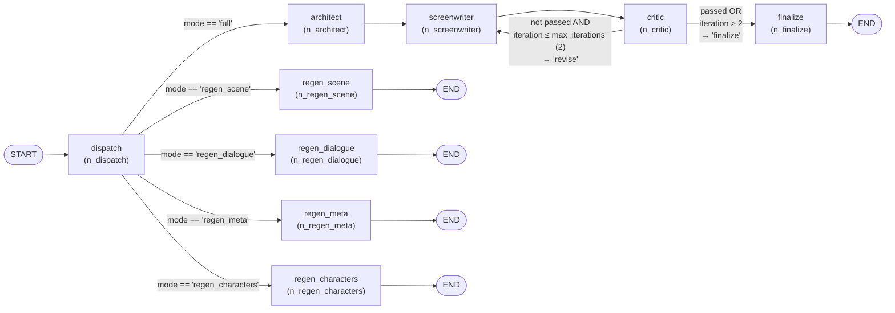
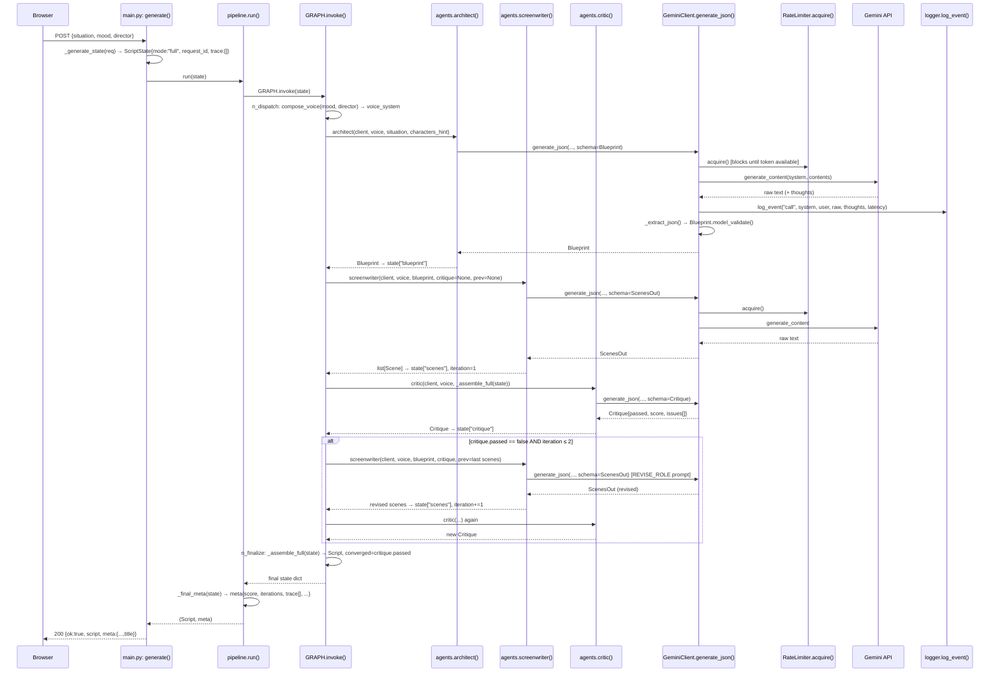
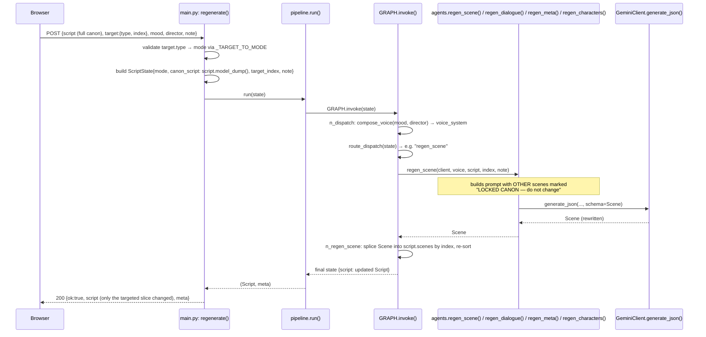

# `backend/app` — Codebase Map (Mermaid)

Four complementary diagrams, because no single diagram can honestly show "every function,
every call, every input/output, every loop" at once without becoming unreadable:

1. **§1 — Static call graph.** Every function in `backend/app`, grouped by file, with an arrow
   for every place one function calls another (or constructs/raises an exception type). This is
   the literal answer to "function calling another function." Read top to bottom, file by file.
2. **§2 — The actual LangGraph runtime flow.** `pipeline.py`'s `_build()` *registers* nodes and
   routing functions — it doesn't show what happens when the graph actually *runs*. This diagram
   is the dynamic execution path: which node runs after which, including the critic↔screenwriter
   loop and all 4 regeneration branches.
3. **§3 — Sequence diagrams** for the three real request types end-to-end (`POST /api/generate`,
   `POST /api/regenerate`, and the `WS /api/generate/ws` live-streaming flow) — these show
   **timing and inputs/outputs** that a call graph can't: who calls whom *in what order*, what
   data crosses each boundary, and (for the WebSocket) the two concurrent lanes (event loop
   thread vs. worker thread) bridged by the queue.
4. **§4 — Data model map.** Every Pydantic schema from `schemas.py`, which function produces
   it, which function consumes it, and how the nested models compose.

Legend used throughout §1:
- `A --> B` (solid arrow) = **A calls B directly** in source code.
- `A -.-> B` (dashed arrow) = **A reads a config value from B**, or **A raises/returns B** (an
  exception type or a singleton), not a function call.
- An edge label in quotes (`-->|"Blueprint"|`) names the **data type** passed across that call.

---

## §1 — Static call graph: every function, every call

```mermaid
flowchart TD
  subgraph CFG["config.py"]
    C_Settings["class Settings(BaseSettings)"]
    C_settings(["settings = Settings()  ←singleton"])
  end

  subgraph SCH["schemas.py — data contracts (see §4 for full detail)"]
    S_note["Character · SceneBeat · Blueprint · DialogueLine · Scene · ScenesOut ·<br/>DialogueOut · CharactersOut · MetaOut · Issue · Critique · Script ·<br/>GenerateRequest · RegenTarget · RegenerateRequest · GenerateResponse"]
  end

  subgraph ST["graph/state.py"]
    ST_State["ScriptState (TypedDict, total=False)"]
  end

  subgraph RL["llm/rate_limiter.py"]
    RL_Exc(["RateLimitExceeded (exception)"])
    RL_init["RateLimiter.__init__()"]
    RL_acquire["RateLimiter.acquire()"]
  end

  subgraph CL["llm/client.py"]
    CL_Exc(["AgentError (exception)"])
    CL_retryable["_is_retryable()"]
    CL_extract["_extract_json()"]
    CL_clientinit["GeminiClient.__init__()"]
    CL_config["GeminiClient._config()"]
    CL_rawcall["GeminiClient._raw_call()"]
    CL_split["GeminiClient._split_parts()"]
    CL_genjson["GeminiClient.generate_json()"]
    CL_getclient(["get_client()  ←lazy singleton"])
  end

  subgraph PL["prompts_loader.py"]
    PL_read["_read()"]
    PL_block["_block()"]
    PL_listmoods["list_moods()"]
    PL_listdirs["list_directors()"]
    PL_pretty["pretty()"]
    PL_inject["_inject()"]
    PL_compose["compose_voice()  ←@lru_cache"]
  end

  subgraph AG["agents.py"]
    AG_architect["architect()"]
    AG_screenwriter["screenwriter()"]
    AG_critic["critic()"]
    AG_regenscene["regen_scene()"]
    AG_regendialogue["regen_dialogue()"]
    AG_regenmeta["regen_meta()"]
    AG_regenchars["regen_characters()"]
  end

  subgraph PI["graph/pipeline.py"]
    PI_trace["_trace()"]
    PI_cleanmood["_clean_mood()"]
    PI_assemble["_assemble_full()"]
    PI_ndispatch["n_dispatch()"]
    PI_narchitect["n_architect()"]
    PI_nscreenwriter["n_screenwriter()"]
    PI_ncritic["n_critic()"]
    PI_nfinalize["n_finalize()"]
    PI_nregenscene["n_regen_scene()"]
    PI_nregendialogue["n_regen_dialogue()"]
    PI_nregenmeta["n_regen_meta()"]
    PI_nregenchars["n_regen_characters()"]
    PI_routedispatch["route_dispatch()"]
    PI_routeaftercritic["route_after_critic()"]
    PI_build["_build()"]
    PI_GRAPHobj(["GRAPH = _build()  ←compiled, module singleton"])
    PI_PIPELINEGRAPH(["PIPELINE_GRAPH  ←static dict for UI"])
    PI_finalmeta["_final_meta()"]
    PI_run["run()"]
    PI_stream["stream()"]
  end

  subgraph LG["observability/logger.py"]
    LG_logfile["_logfile()"]
    LG_short["_short()"]
    LG_logevent["log_event()"]
  end

  subgraph MAIN["main.py"]
    M_appinit["app = FastAPI() + CORSMiddleware + static mount"]
    M_err["_err()"]
    M_dirimg["_director_image()"]
    M_health["health()<br/>GET /api/health"]
    M_options["options()<br/>GET /api/options"]
    M_pipelineEP["pipeline()<br/>GET /api/pipeline"]
    M_genstate["_generate_state()"]
    M_generate["generate()<br/>POST /api/generate"]
    M_sse["_sse()"]
    M_generatestream["generate_stream()<br/>POST /api/generate/stream"]
    M_gen["gen()  [nested generator]"]
    M_generatews["generate_ws()<br/>WS /api/generate/ws"]
    M_worker["worker()  [nested, runs in a thread]"]
    M_emit["emit()  [nested closure]"]
    M_wsjson["_ws_json()"]
    M_regenerate["regenerate()<br/>POST /api/regenerate"]
    M_root["root()<br/>GET /"]
  end

  %% ---------- config.py is read by (dashed) ----------
  C_settings -.->|"gemini_api_key, gemini_model, rpm/rpd_limit"| CL_clientinit
  C_settings -.->|"enable_thinking, max_retries"| CL_rawcall
  C_settings -.->|"temperature"| CL_config
  C_settings -.->|"max_iterations"| PI_routeaftercritic
  C_settings -.->|"prompts_dir"| PL_read
  C_settings -.->|"log_dir"| LG_logfile
  C_settings -.->|"cors_origins, director_images_dir"| M_appinit
  C_settings -.->|"gemini_model, gemini_api_key"| M_health
  C_settings -.->|"director_images_dir"| M_dirimg

  %% ---------- rate_limiter.py internal ----------
  RL_acquire -.->|raises when daily cap hit| RL_Exc

  %% ---------- client.py internal ----------
  CL_getclient --> CL_clientinit
  CL_clientinit --> RL_init
  CL_genjson --> CL_rawcall
  CL_rawcall --> CL_config
  CL_rawcall --> RL_acquire
  CL_rawcall -.->|classifies caught exception via| CL_retryable
  CL_genjson --> CL_split
  CL_genjson -->|"raw answer text"| CL_extract
  CL_genjson --> LG_logevent
  CL_genjson -.->|raises after 2nd failed validation| CL_Exc

  %% ---------- prompts_loader.py internal ----------
  PL_compose --> PL_read
  PL_compose --> PL_inject
  PL_compose --> PL_block
  PL_block --> PL_read

  %% ---------- agents.py → client.py ----------
  AG_architect -->|"system, user → "| CL_genjson
  AG_screenwriter -->|"system, user → "| CL_genjson
  AG_critic -->|"system, user → "| CL_genjson
  AG_regenscene -->|"system, user → "| CL_genjson
  AG_regendialogue -->|"system, user → "| CL_genjson
  AG_regenmeta -->|"system, user → "| CL_genjson
  AG_regenchars -->|"system, user → "| CL_genjson

  %% ---------- pipeline.py nodes → agents.py / client.py / prompts_loader.py ----------
  PI_ndispatch --> PL_compose
  PI_ndispatch --> PI_trace
  PI_narchitect --> CL_getclient
  PI_narchitect -->|"situation, characters_hint"| AG_architect
  PI_narchitect --> PI_trace
  PI_nscreenwriter --> CL_getclient
  PI_nscreenwriter -->|"Blueprint, [Critique], [prev Scenes]"| AG_screenwriter
  PI_nscreenwriter --> PI_trace
  PI_ncritic --> CL_getclient
  PI_ncritic --> PI_assemble
  PI_ncritic -->|"Script"| AG_critic
  PI_ncritic --> PI_trace
  PI_nfinalize --> PI_assemble
  PI_nfinalize --> PI_trace
  PI_nregenscene --> CL_getclient
  PI_nregenscene -->|"Script, index, note"| AG_regenscene
  PI_nregenscene --> PI_trace
  PI_nregendialogue --> CL_getclient
  PI_nregendialogue -->|"Script, index, note"| AG_regendialogue
  PI_nregendialogue --> PI_trace
  PI_nregenmeta --> CL_getclient
  PI_nregenmeta -->|"Script, note"| AG_regenmeta
  PI_nregenmeta --> PI_trace
  PI_nregenchars --> CL_getclient
  PI_nregenchars -->|"Script, note"| AG_regenchars
  PI_nregenchars --> PI_trace
  PI_assemble --> PI_cleanmood
  PI_assemble --> PL_pretty

  %% ---------- _build() registers nodes/routing (NOT runtime calls — see §2) ----------
  PI_build -.->|registers| PI_ndispatch
  PI_build -.->|registers| PI_narchitect
  PI_build -.->|registers| PI_nscreenwriter
  PI_build -.->|registers| PI_ncritic
  PI_build -.->|registers| PI_nfinalize
  PI_build -.->|registers| PI_nregenscene
  PI_build -.->|registers| PI_nregendialogue
  PI_build -.->|registers| PI_nregenmeta
  PI_build -.->|registers| PI_nregenchars
  PI_build -.->|registers conditional edge| PI_routedispatch
  PI_build -.->|registers conditional edge| PI_routeaftercritic
  PI_build --> PI_GRAPHobj

  %% ---------- run() / stream() drive GRAPH ----------
  PI_run -->|"ScriptState"| PI_GRAPHobj
  PI_run --> PI_finalmeta
  PI_run -.->|catches AgentError, logs, re-raises| LG_logevent
  PI_run -.->|raises if "script" missing| CL_Exc
  PI_stream -->|"ScriptState"| PI_GRAPHobj

  %% ---------- logger.py internal ----------
  LG_logevent --> LG_logfile
  LG_logevent --> LG_short

  %% ---------- main.py: meta/options endpoints ----------
  M_health --> PL_listmoods
  M_health --> PL_listdirs
  M_options --> PL_listmoods
  M_options --> PL_listdirs
  M_options --> PL_pretty
  M_options --> M_dirimg
  M_pipelineEP -->|"returns"| PI_PIPELINEGRAPH

  %% ---------- main.py: POST /api/generate ----------
  M_generate -->|"GenerateRequest"| M_genstate
  M_genstate -->|"ScriptState (mode=full)"| M_generate
  M_generate -->|"ScriptState"| PI_run
  PI_run -->|"(Script, meta)"| M_generate
  M_generate -.->|catches| RL_Exc
  M_generate -.->|catches| CL_Exc
  M_generate --> M_err

  %% ---------- main.py: POST /api/generate/stream (SSE) ----------
  M_generatestream --> M_genstate
  M_generatestream --> M_gen
  M_gen -->|"ScriptState"| PI_stream
  PI_stream -->|"(node, partial) per step"| M_gen
  M_gen --> PI_finalmeta
  M_gen --> M_sse
  M_gen -.->|catches, yields error event| RL_Exc

  %% ---------- main.py: WS /api/generate/ws ----------
  M_generatews --> M_genstate
  M_generatews --> M_worker
  M_worker -->|"ScriptState"| PI_stream
  PI_stream -->|"(node, partial) per step"| M_worker
  M_worker --> PI_finalmeta
  M_worker --> M_emit
  M_emit -.->|"loop.call_soon_threadsafe(queue.put_nowait, evt)"| M_generatews
  M_generatews --> M_wsjson
  M_worker -.->|catches, emits error event| RL_Exc

  %% ---------- main.py: POST /api/regenerate ----------
  M_regenerate -->|"RegenerateRequest"| M_regenerate
  M_regenerate -->|"ScriptState (mode=regen_*)"| PI_run
  PI_run -->|"(Script, meta)"| M_regenerate
  M_regenerate -.->|catches| RL_Exc
  M_regenerate -.->|catches| CL_Exc
  M_regenerate --> M_err
```

### Reading this diagram

- **`agents.py` is the only file that calls `client.py`'s `generate_json()`.** Every one of the
  7 agent functions funnels through the exact same method — this is the "single choke point"
  claim made concrete as a literal graph property: count the arrows into `CL_genjson`.
- **`pipeline.py`'s node functions (`n_*`) are the only callers of `agents.py`.** Nothing in
  `main.py` ever calls an agent directly — it always goes through `run()`/`stream()` →
  `GRAPH` → a node → the agent. This is what makes the HTTP/WebSocket layer in `main.py`
  completely oblivious to *how* a script gets made.
- **`get_client()` has exactly one real implementation (`CL_clientinit`) called from many
  places**, but it's only *constructed* once — every node's `CL_getclient` arrow returns the
  same singleton instance, including the same `RateLimiter` instance, which is the whole basis
  for the daily/per-minute counters being accurate process-wide.
- **The dashed arrows into `RL_Exc`/`CL_Exc`** are the two custom exception types; tracing them
  shows every place a rate-limit or agent failure can *originate* (3 places) versus every place
  it gets *caught* (the 3 endpoint functions in `main.py`, plus `pipeline.run()`'s logging
  pass-through).

---

## §2 — The actual LangGraph runtime flow (what `_build()` wires up, executing)

`_build()` in §1 only *registers* nodes and routing functions — it runs once at import time and
produces nothing more than a compiled graph object. **This diagram is what happens every time a
request actually runs**: which node executes after which, decided dynamically at runtime by
`route_dispatch()` and `route_after_critic()` reading the live `ScriptState`.



### The loop-guard arithmetic, traced through

`iteration` starts at `0` (set by `dispatch`), and `n_screenwriter` increments it **every time
it runs**, including the very first pass — so by the time `critic` first runs, `iteration == 1`
already.

| Screenwriter pass | `iteration` after | `route_after_critic` check | Outcome if critic fails |
|---|---|---|---|
| 1st (fresh draft) | 1 | `1 > 2`? No | → revise |
| 2nd (1st revision) | 2 | `2 > 2`? No | → revise |
| 3rd (2nd revision) | 3 | `3 > 2`? Yes | → finalize anyway (`converged=false`) |

So `max_iterations = 2` actually permits **up to 3 total screenwriter passes** (1 original + 2
revisions) — the setting really means "max revision passes," not "max screenwriter calls." This
is the kind of off-by-one detail worth being able to trace live if asked.

### Regeneration branches never touch the critic loop at all

Notice in the diagram that `RegenScene`/`RegenDialogue`/`RegenMeta`/`RegenCharacters` each go
**straight to `END`** — none of them route through `critic`. This is intentional: a
regeneration is a single, narrow, user-requested fix to one slice of an already-existing,
previously-approved script; re-running the full quality gate on a one-scene tweak would be
both wasteful (extra Gemini calls against the rate-limit budget) and could second-guess a
change the user explicitly asked for.

---

## §3 — Sequence diagrams: the three request types, end to end

### 3a. `POST /api/generate` — full generation (synchronous, no streaming)



### 3b. `POST /api/regenerate` — single-section regeneration



### 3c. `WS /api/generate/ws` — live streaming (the production path)

Two concurrent lanes: the **event loop** (async, handles the socket) and a **worker thread**
(sync, runs the actual blocking pipeline). They're bridged only by `asyncio.Queue` +
`call_soon_threadsafe` — this is the one diagram in this document where *thread boundaries*
matter as much as function calls.

```mermaid
sequenceDiagram
  participant FE as Browser
  participant EL as Event loop: generate_ws()
  participant Q as asyncio.Queue
  participant TH as Worker thread: worker()
  participant GR as GRAPH.stream()

  FE->>EL: WebSocket connect /api/generate/ws
  EL->>FE: accept()
  FE->>EL: send GenerateRequest JSON (first frame)
  EL->>EL: GenerateRequest.model_validate(...)
  EL->>EL: initial = _generate_state(req); loop = get_running_loop(); queue = Queue()
  EL->>TH: asyncio.create_task(asyncio.to_thread(worker))  [starts immediately, concurrent]

  par worker thread runs the blocking pipeline
    TH->>GR: for node, partial in stream(initial)
    GR-->>TH: ("dispatch", partial)
    TH->>Q: call_soon_threadsafe(put_nowait, {"type":"step","node":"dispatch",...})
    GR-->>TH: ("architect", partial)
    TH->>Q: emit step "architect"
    GR-->>TH: ("screenwriter", partial)
    TH->>Q: emit step "screenwriter"
    GR-->>TH: ("critic", partial)
    TH->>Q: emit step "critic"
    Note over GR,TH: critic→screenwriter loop may repeat here,<br/>each pass emitting its own step events
    GR-->>TH: ("finalize", partial)
    TH->>Q: emit step "finalize"
    TH->>Q: emit {"type":"result","script":...,"meta":...}
    TH->>Q: emit None  (sentinel: worker done)
  and event loop drains the queue as items arrive
    loop EL is alive
      EL->>Q: await queue.get()
      Q-->>EL: step event
      EL->>FE: send_text(step event)
    end
    Q-->>EL: result event
    EL->>FE: send_text(result event)
    Q-->>EL: None sentinel
    EL->>EL: break loop
  end

  EL->>TH: await task  (ensures thread fully finished / reaped)
  EL->>FE: close()
```

**Why this matters as a diagram, not just prose:** the "par" block is the literal picture of
why a blocking, ~80-second multi-call pipeline doesn't freeze the server — the worker thread
lane and the event-loop lane run **simultaneously**, and the only synchronization point between
them is the queue. If the browser disconnects mid-stream, the event-loop lane exits via a caught
`WebSocketDisconnect`, but the worker-thread lane **keeps running to completion regardless** —
there's no cancellation; `await task` in the `finally` block is what stops the thread from being
silently orphaned.

---

## §4 — Data model map: every schema, who produces it, who consumes it

```mermaid
flowchart LR
  GenReq(["GenerateRequest<br/>{situation, mood, director, characters_hint}"])
  RegenReq(["RegenerateRequest<br/>{script, target, mood, director, note}"])
  RegenTarget(["RegenTarget<br/>{type, index}"])
  GenResp(["GenerateResponse<br/>{ok, script, meta}"])

  Architect_fn["agents.architect()"]
  Screenwriter_fn["agents.screenwriter()"]
  Critic_fn["agents.critic()"]
  RegenScene_fn["agents.regen_scene()"]
  RegenDialogue_fn["agents.regen_dialogue()"]
  RegenMeta_fn["agents.regen_meta()"]
  RegenChars_fn["agents.regen_characters()"]
  Assemble_fn["pipeline._assemble_full()"]

  Character(["Character<br/>{name, role, description, want, fear, contradiction}"])
  SceneBeat(["SceneBeat<br/>{scene_index, intent, heading, characters[], escalation}"])
  Blueprint(["Blueprint<br/>{movie_title, tagline, logline, mood, characters[], scene_plan[]}"])
  DialogueLine(["DialogueLine<br/>{character, delivery, line}"])
  Scene(["Scene<br/>{scene_index, scene_title, heading, scene_description, dialogue[]}"])
  ScenesOut(["ScenesOut<br/>{scenes[]}  ← wrapper, list response"])
  DialogueOut(["DialogueOut<br/>{dialogue[]}  ← wrapper"])
  CharactersOut(["CharactersOut<br/>{characters[]}  ← wrapper"])
  MetaOut(["MetaOut<br/>{movie_title, tagline, logline}"])
  Issue(["Issue<br/>{scene_index, problem, fix}"])
  Critique(["Critique<br/>{passed, score, issues[], note}"])
  Script(["Script<br/>{movie_title, tagline, mood, logline,<br/>directed_in_the_style_of, characters[], scenes[]}"])

  GenReq -->|"input"| Architect_fn
  Architect_fn -->|"produces"| Blueprint
  Blueprint -->|"contains"| Character
  Blueprint -->|"contains"| SceneBeat

  Blueprint -->|"input"| Screenwriter_fn
  Critique -.->|"input on revision pass"| Screenwriter_fn
  Screenwriter_fn -->|"produces"| ScenesOut
  ScenesOut -->|"contains"| Scene
  Scene -->|"contains"| DialogueLine

  Blueprint -->|"title/tagline/mood/characters"| Assemble_fn
  Scene -->|"sorted scenes[]"| Assemble_fn
  Assemble_fn -->|"produces"| Script

  Script -->|"input"| Critic_fn
  Critic_fn -->|"produces"| Critique
  Critique -->|"contains"| Issue
  Critique -.->|"feeds back into"| Screenwriter_fn

  Script -->|"canon, input"| RegenScene_fn
  RegenScene_fn -->|"produces (single)"| Scene

  Script -->|"canon, input"| RegenDialogue_fn
  RegenDialogue_fn -->|"produces"| DialogueOut
  DialogueOut -->|"contains"| DialogueLine

  Script -->|"canon, input"| RegenMeta_fn
  RegenMeta_fn -->|"produces"| MetaOut

  Script -->|"canon, input"| RegenChars_fn
  RegenChars_fn -->|"produces"| CharactersOut
  CharactersOut -->|"contains"| Character

  RegenReq -->|"contains"| Script
  RegenReq -->|"contains"| RegenTarget

  Script -->|"API response body"| GenResp
```



### Notes on this map

- **`ScenesOut` / `DialogueOut` / `CharactersOut`** exist purely as **wrapper types** — see
  `CODE_WALKTHROUGH.md` §2 — because `generate_json()` always asks the model for "a single JSON
  object," so any agent whose natural output is a bare list needs a named-field wrapper around
  it. They're never stored anywhere long-term; they're unwrapped immediately at the call site
  (e.g. `agents.screenwriter()` returns `out.scenes`, not the `ScenesOut` object itself).
- **`Blueprint` and `Script` are structurally different on purpose.** `Blueprint.scene_plan:
  list[SceneBeat]` holds *unwritten* beats (intent + escalation notes, no dialogue);
  `Script.scenes: list[Scene]` holds *fully written* scenes. `_assemble_full()` is the only
  function that bridges the two, and it's why a half-finished generation (one that died after
  the Architect but before the Screenwriter) can never accidentally produce a `Script` —
  there's no code path that skips straight from a `Blueprint` to a `Script` without scenes
  actually having been written first.
- **`Critique` is the only schema with a feedback edge back into a producer function**
  (`Screenwriter_fn`) — every other arrow flows strictly forward. This is the one schema-level
  trace of the critic↔screenwriter loop from §2.
- **`Script` is the most-reused type in the whole system**: it's what every regeneration
  function takes as input (as the round-tripped "canon"), what the critic judges, and what's
  finally serialized into `GenerateResponse` — it is the one schema that's simultaneously an
  internal working object and the literal public API/persistence shape (it's also exactly what
  gets JSON-serialized into `localStorage` on the frontend and into a Firestore document for
  sharing).

---

## How these four views fit together

- Reach for **§1** when asked "what does function X call" or "where does Y come from in code."
- Reach for **§2** when asked "what's the actual order things run in" or about the loop guard /
  regeneration not re-entering the critic.
- Reach for **§3** when asked to narrate a request end-to-end, especially the WebSocket
  threading mechanics — it's the only view that shows *time* and *concurrency*, not just
  structure.
- Reach for **§4** when asked about the type contracts, why wrapper types exist, or how a
  `Blueprint` becomes a `Script`.

